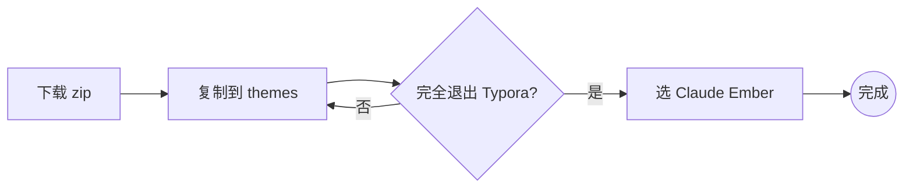
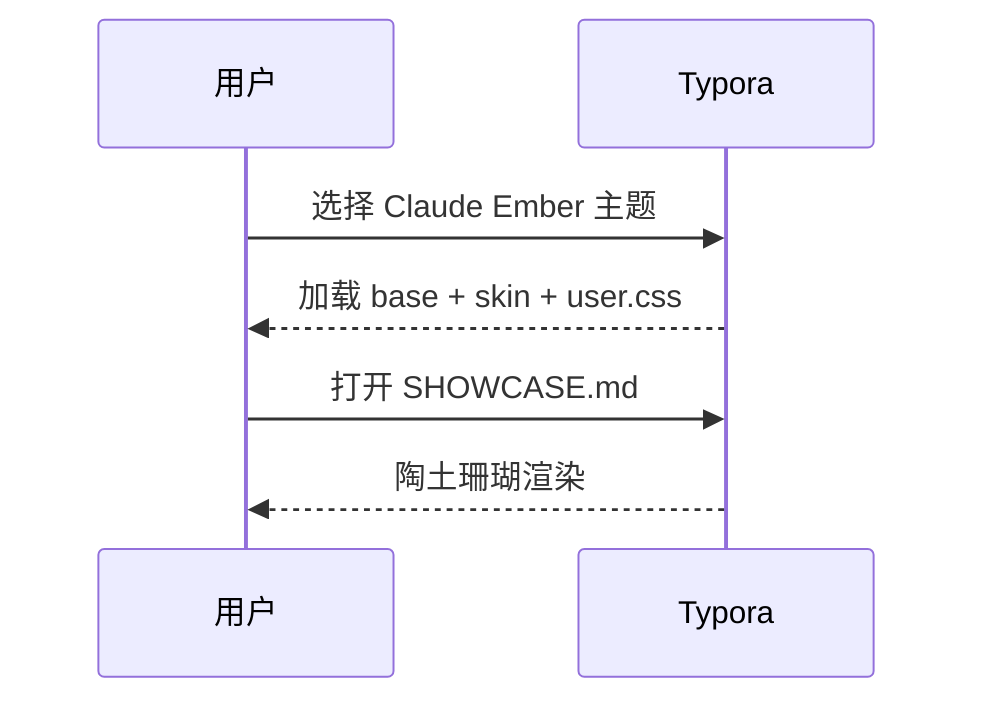
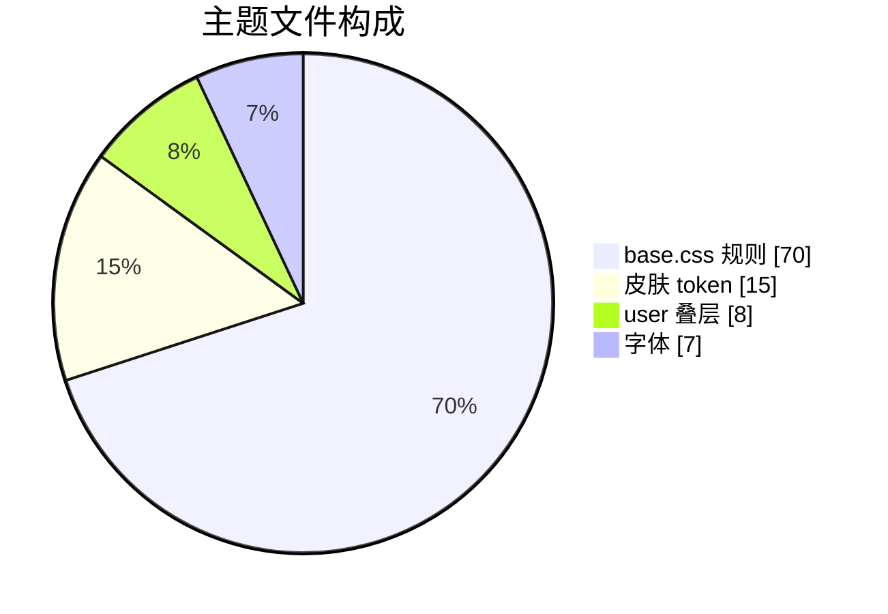
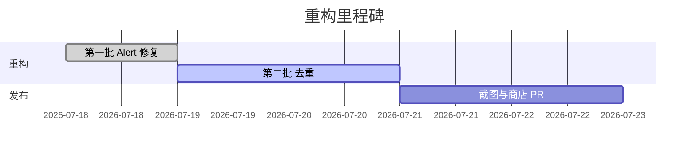
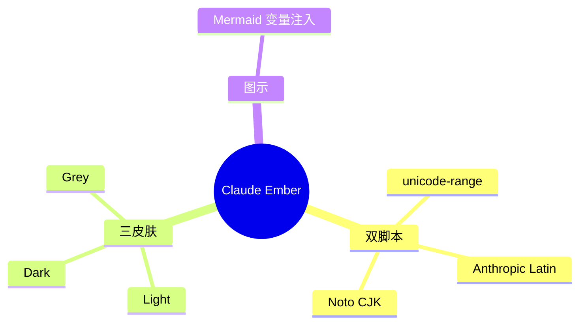
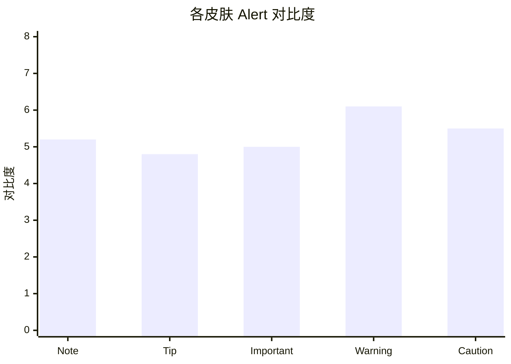

[TOC]

# Claude Ember — 全标签渲染样张 H1

> 一份把 Markdown 能力压满的验收文档：暖奶油纸 · 陶土珊瑚 · 双脚本字体 · 全标签矩阵。打开它即可看到本主题在 **Light / Dark / Grey** 三皮肤下的完整表现。

## 二级标题 H2

### 三级标题 H3

#### 四级标题 H4

##### 五级标题 H5

###### 六级标题 H6（小型大写 UI 字）

---

## 一、文本与行内元素

正文段落检查中英混排的呼吸感：Anthropic Serif 负责拉丁 **mixed English typography**，思源宋体只接管中文衬线——这是本主题独有的 `unicode-range` 双脚本分离。一段稍长的中文用于观察行高 1.72、字距与标点悬挂：光影在暖奶油纸上安静地流动，珊瑚色只在需要强调处轻轻点一下，克制而不喧哗。

行内密集展示：`inline code`、**加粗 bold**、*斜体 italic*、***粗斜 bold-italic***、~~删除线~~、==高亮 mark==、<u>下划线</u>、<ins>插入 ins</ins>、上标 x^2^、下标 H~2~O、<kbd>Ctrl</kbd>+<kbd>Shift</kbd>+<kbd>P</kbd>、<samp>sample output</samp>、<var>variable</var>、<abbr title="Cascading Style Sheets">CSS</abbr>、<cite>引用来源</cite>、<q>行内引言</q>、<dfn>术语定义</dfn>、<time>2026-07-18</time>、<small>小号附注</small>、脚注[^note]、表情 :rocket: :sparkles:、注音 <ruby>漢字<rt>hàn zì</rt></ruby>。

强调组合边界：**加粗里的 *斜体***、*斜体里的 **加粗***、~~删除里的 `代码`~~、**加粗 `代码`**、==高亮 `代码`==、[**加粗链接**](https://claude.com)。

链接形态：[行内链接](https://claude.com)、<https://自动链接.example.com>、[引用式链接][ref]、[锚点跳转](#四、表格全形态)。

[ref]: https://anthropic.com "引用式链接标题"

## 二、引用嵌套 1–6 层

> L1 一层引用：暖珊瑚渐变左边线。
>
> > L2 二层：颜色加深。
> >
> > > L3 三层：更淡的边线。
> > >
> > > > L4 四层：细线渐弱。
> > > >
> > > > > L5 五层：虚线。
> > > > >
> > > > > > L6 六层：点线，仍可读。

> [!NOTE]
> 引用里也能放**块内容**：
>
> | 键 | 值 |
> |---|---|
> | 引用内表格 | ✅ |
>
> ```js
> console.log("引用内代码围栏");
> ```
>
> - 引用内列表
>   - 嵌套项

## 三、列表与任务

- 无序一层 disc
  - 二层 circle
    - 三层 square
      - 四层（循环回 disc）
- 松散列表项，含多段

  第二段落，间距拉开。

1. 有序 decimal
   1. 二层 lower-alpha
      1. 三层 lower-roman
2. 混合嵌套
   - 有序里套无序
     1. 再套回有序

任务列表（可点 + 完成态 + 嵌套）：

- [x] 已完成的主任务
  - [x] 已完成子任务
  - [ ] 未完成子任务
- [ ] 未开始
  - [ ] 计划 A
  - [ ] 计划 B

## 四、定义列表

<dl>
<dt>陶土珊瑚 Terracotta</dt>
<dd>强调色 <code>#d97757</code>，取自炭火余烬的暖光。</dd>
<dt>奶油纸 Cream</dt>
<dd>背景 <code>#faf9f5</code>，低刺激的阅读底。</dd>
<dt>双脚本字体</dt>
<dd>Anthropic 管 Latin，Noto Serif SC 只管 CJK，靠 <code>unicode-range</code> 分离。</dd>
</dl>

## 五、表格全形态

| 左对齐 | 居中 | 右对齐 | 富内容 |
|:-------|:----:|-------:|:-------|
| 特性 | 状态 | 行数 | 说明 |
| 双脚本分离 | ✅ | 12 | `unicode-range` |
| Mermaid 注入 | ✅ | 340 | 见 §七 |
| 三皮肤 | ✅ | 3 | Light/Dark/Grey |
| 单元格公式 | $E=mc^2$ | 1 | 行内数学 |
| 单元格链接 | [Claude](https://claude.com) | — | 富元素 |

宽表（横向滚动检查）：

| 模块 | Light | Dark | Grey | 变量 | 版本 | 备注一 | 备注二 | 备注三 | 备注四 |
|---|---|---|---|---|---|---|---|---|---|
| Alert | ✅ | ✅ | ✅ | `--alert-*` | v39 | 五色语义 | 变量驱动 | 三皮肤一致 | AA 对比度 |
| 表格 | ✅ | ✅ | ✅ | `--table-*` | v6 | sticky 头 | 斑马纹 | width:auto | 单元格富元素 |

## 六、代码围栏（多语言）

```python
def dual_script(latin: str, cjk: str) -> str:
    """Anthropic 管拉丁，Noto 管中文。"""
    return f"{latin} · {cjk}"  # unicode-range 分离
```

```rust
fn main() {
    let accent = "#d97757";
    println!("Claude Ember: {accent}");
}
```

```json
{ "theme": "Claude Ember", "skins": ["light", "dark", "grey"], "dualScript": true }
```

```diff
- border-left-color: #5b8fc7 !important;   /* 旧：硬编码架空皮肤 */
+ border-left-color: var(--accent-blue) !important;  /* v39：回归变量 */
```

行内 `const x = 1;` 与自动链接 <https://mermaid.js.org> 混排。

## 七、Mermaid 图集













## 八、数学公式

行内 $a^2 + b^2 = c^2$、$\sum_{i=1}^{n} i = \frac{n(n+1)}{2}$。

块级积分：

$$
\int_{-\infty}^{\infty} e^{-x^2}\,dx = \sqrt{\pi}
$$

矩阵（宽内容横滚检查）：

$$
\mathbf{A} = \begin{bmatrix}
a_{11} & a_{12} & \cdots & a_{1n} \\
a_{21} & a_{22} & \cdots & a_{2n} \\
\vdots & \vdots & \ddots & \vdots \\
a_{m1} & a_{m2} & \cdots & a_{mn}
\end{bmatrix}
$$

## 九、GFM Alert 五色 + 内嵌

> [!NOTE]
> 蓝色信息。内嵌代码 `note` 与列表：
> - 项目一
> - 项目二

> [!TIP]
> 绿色建议。内嵌**表格**：
>
> | 提示 | 效果 |
> |---|---|
> | 用变量 | 三皮肤一致 |

> [!IMPORTANT]
> 紫色重点。内嵌公式 $\Delta = b^2 - 4ac$。

> [!WARNING]
> 金色警告。内嵌任务：
> - [x] 已检查
> - [ ] 待复核

> [!CAUTION]
> 玫红危险。内嵌引用：
> > 嵌套引用在 Alert 内。

## 十、details 折叠嵌套

> Typora 的 `<details>` 是 HTML Block：**内部不解析 Markdown、且不能有空行**（空行会把折叠内容"漏"到框外）。所以内容要用紧凑 HTML 标签写。

<details>
<summary>点击展开：安装步骤（含代码与列表）</summary>
<ol>
<li>下载 Release zip</li>
<li>解压到 <code>%APPDATA%\Typora\themes\</code></li>
<li><strong>完全退出</strong> Typora 再打开</li>
</ol>
<pre><code>powershell -ExecutionPolicy Bypass -File .\install.ps1</code></pre>
<details>
<summary>二层折叠：macOS 路径</summary>
<p><code>~/Library/Application Support/abnerworks.Typora/themes/</code></p>
</details>
</details>

## 十一、极限组合嵌套（压力测试）

> [!IMPORTANT]
> **Alert ⊃ 表格 ⊃ 行内代码 ⊃ 公式**：
>
> | 项 | 值 | 公式 |
> |---|---|---|
> | 强调 | `code` | $\pi r^2$ |
>
> 引用内再套列表：
> - 层一
>   - [ ] 任务在引用的 Alert 里

- 列表项内嵌 Mermaid：

  ```mermaid
  stateDiagram-v2
      [*] --> Light
      Light --> Dark
      Dark --> Grey
      Grey --> [*]
  ```

- 列表项内嵌数学块：

  $$ f(x) = \int_0^x t^2\,dt = \frac{x^3}{3} $$

---

## 十二、分隔与媒体

图片（占位，测试图题与坏图占位）：


<hr>

小结：以上覆盖标题、全行内元素、6 层引用、多层列表与任务、定义列表、表格全形态、多语言代码、7 类 Mermaid、数学矩阵、五色 Alert、details 嵌套、极限组合嵌套。三皮肤下均应保持"安静克制、层级清晰、无彩虹左轨"的 Claude Ember 气质。

[^note]: 这是脚注内容，测试脚注区卡片化与回跳箭头。
